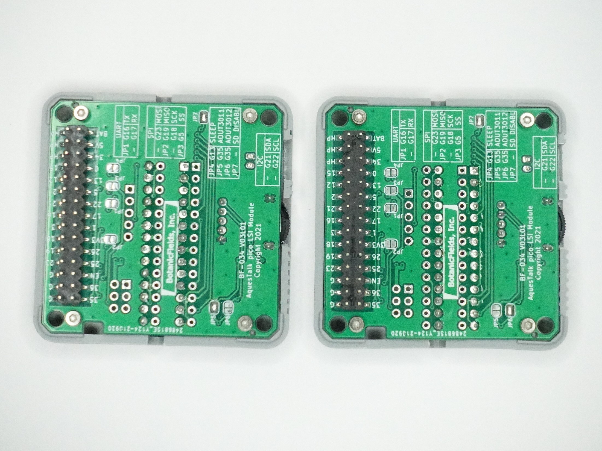
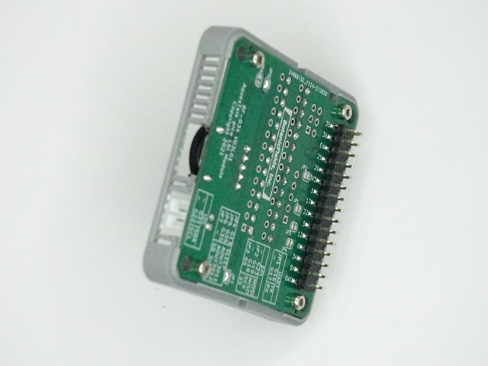

# PCB-MBUS-AquesTalk-pico-LSI
MBUS Module of AquesTalk pico LSI for M5Stack

# 1. 概要
「M5Stack用 AquesTalk pico LSI モジュール」は、市販の音声合成専用 LSI「AquesTalk pico LSI」（別売）を M-BUS モジュールとして M5Stack に取り付けるための半完成基板です。AquesTalk pico LSI の詳細は、データシートを参照ください。
- [Data Sheet 音声合成 LSI 「AquesTalk pico LSI」ATP3011](https://www.a-quest.com/archive/manual/atp3011_datasheet.pdf)
- [Data Sheet 音声合成 LSI 「AquesTalk pico LSI」ATP3012](https://www.a-quest.com/archive/manual/atp3012_datasheet.pdf)

### 組み立て例
   

## 1.1 特徴
- 28 ピン DIP タイプの AquesTalk pico LSI 1 個を搭載できます。
- ATP3011, ATP3012 の両方の AquesTalk pico LSI に対応しています。
- PROTO モジュールのモールドを流用し、M5Stack に取り付けできます。
- M-BUS 接続により、スピーカー以外のケーブル接続が不要です。
- パワーアンプ（LM4871）を内蔵し、スピーカーを直接に接続できます。
- DIP スイッチで動作モード・通信モードの全ての選択肢から設定できます。
- I2C, SPI, UART の全ての接続を試すことができます。
- スタンドアロンモードのためのランドがあります。

## 1.2 商品内容
- M-BUS モジュール基板（半完成品※）1枚  
※ AquesTalk pico LSI（別売）の取り付けが必要です。
- スピーカーケーブル 1 組（2 ピン PH 相当コネクタ付き、20cm 片端ストリップ済）  
（秋月電子通商扱い）コネクタ付コード２Ｐ（Ａ）　（赤白）[DG01032-0045-01(C5679)](https://akizukidenshi.com/catalog/g/gC-05679/)
- 説明書

 

## 1.3 別途必要なもの
- AquesTalk pico LSI（秋月電子通商扱い）  
音声合成ＬＳＩ　ＡＴＰ３０１１Ｆ１－ＰＵ（ゆっくりな女性の音声）
[ATP3011F1-PU](https://akizukidenshi.com/catalog/g/gI-06220/)  
音声合成ＬＳＩ　ＡＴＰ３０１１Ｆ４－ＰＵ（かわいい女性の音声）
[ATP3011F4-PU](https://akizukidenshi.com/catalog/g/gI-05665/)  
音声合成ＬＳＩ　ＡＴＰ３０１１Ｍ６－ＰＵ（男性の音声）
[ATP3011M6-PU](https://akizukidenshi.com/catalog/g/gI-06225/)  
音声合成ＬＳＩ　ＡＴＰ３０１２Ｆ６－ＰＵ（女性の音声明瞭版）
[ATP3012F6-PU](https://akizukidenshi.com/catalog/g/gI-09973/)  
音声合成ＬＳＩ　ＡＴＰ３０１２Ｒ５－ＰＵ（小型ロボットの音声）
[ATP3012R5-PU](https://akizukidenshi.com/catalog/g/gI-11517/)
- スピーカー  
4 ～ 8Ω 程度、1W 以上が望ましいです
- 工具類  
ハンダ、ハンダごて、ニッパー、六角レンチ(0.5mm)、カッター、ピンセットなど
- M5Stack  
サンプルプログラムは、M5Stack Core Basic で動作確認しています
- Arudino-IDE が動作する環境  
Arduin-IDE Ver.1.18.16, M5Stack Boards Manager 2.0.0 以降

# 2. モジュール基板の組み立て

## 2.1 AquesTalk pico LSI の取り付け
別売の AquestTalk pico LSI（28 ピン DIP パッケージ）を 1 個搭載できます。ATP3011 と ATP3012 とでは取り付け穴が異なります。基板上のシルク印刷に従ってピンを差し込み、はんだ付けします。はんだ付け後、モジュール基板裏面から飛び出しているピンを短く切ってください。

   

## 2.2 モールドの取り付け
プロトモジュールのモールドおよびネジ 4 本を流用して、M5Stack の M-BUS モジュールに仕立てることができます。モールドをモジュール基板に取り付ける前に、ボリュームやスピーカー出力コネクタの部分をモジュールから切り取ります。

     

### IC ソケットは使用できません
IC ソケットを使用すると、プロトモジュールのモールドには収まらなくなります。収まらなくなることを承知の上で 1 列タイプのIC ソケットを使用すると ATP3011 と ATP3012 を差し換えることはできますが、モジュール基板裏面からのピンの飛び出しの対処も大変になります。

- ICソケット（秋月電子通商扱い）  
丸ピンＩＣ用ソケット　（シングル１４Ｐ）　１×１４
[6604S-14](https://akizukidenshi.com/catalog/g/gP-03470/)  
丸ピンＩＣ用ソケット　（シングル１４Ｐ）　１×１４
[JS-11791SFTD-14](https://akizukidenshi.com/catalog/g/gP-11451/)  ※在庫限り  

 

### その他の端子について
J2 は、ICSP です。コネクタ等は実装していません。使用には、ピンヘッダをハンダ付けするなどの処置が必要です。ICSP の VCC は AquesTalk pico LSI の電源端子に繋がっているほか、M5Stack の 3.3V にも繋がっています。ICSP は、モジュール基板を M5Stack から切り離し、単体にして接続してください。  
J3 は、スタンドアロンモードで使用する PC0-3 および GND の端子です。コネクタ等は実装していません。使用には信号ケーブルを直接はんだ付けするなどの処置が必要です。

- ICSP: In Circuit Serial Programming

### スタンドアロン接続例
「M5Stack用 AquesTalk pico LSI モジュール」を「M-Busエクステンション基板」に載せ、「ダイオードマトリクススイッチ基板15」を接続しています。M5Stack の電源とリセットを使用しています。
- [M-Busエクステンション基板キット](https://www.switch-science.com/catalog/7371/)
- [ダイオードマトリクススイッチ15基板](https://www.switch-science.com/catalog/7371/)

# 3. モジュールの設定（DIP スイッチ）

## 3.1 DIP スイッチによる動作モード・通信モードの設定
動作モード、および使用するインタフェース（通信モード）に合わせて、モジュール基板上の DIP スイッチを設定します。設定にはピンセットなどが必要です。おすすめは I2C 接続です。出荷時の設定は、セーフモード、I2C 接続です。インタフェース毎の設定を次項以降で説明しています。

|DIPスイッチ 1 |DIPスイッチ 2 |DIPスイッチ 3 |DIPスイッチ 4 |動作モード|通信モード|
|:-:|:-:|:-:|:-:|:-:|:-:|
|OFF|OFF| - | - | コマンド入力モード | - |
|OFF|ON | - | - | セーフモード | - |
|ON |OFF| - | - | スタンドアロンモード | - |
|ON |ON | - | - | デモモード | - |
| - | - |OFF|OFF| - | UART |
| - | - |OFF|ON | - | I2C |
| - | - |ON |OFF| - | SPI mode 3 |
| - | - |ON |ON | - | SPI mode 0 |

※DIP スイッチは、ON で GND 接続する回路のため、ON = 0, OFF = 1 です。

## (1) I2C 接続の設定

|DIPスイッチ 1 |DIPスイッチ 2 |DIPスイッチ 3 |DIPスイッチ 4 |動作|
|:-:|:-:|:-:|:-:|:- |
|OFF|OFF|OFF|ON |I2C アドレスは EEPROM に設定した値（初期値 0x2E）|
|OFF|ON |OFF|ON |I2C アドレスは強制的に 0x2E|

## (2) SPI 接続の設定

|DIPスイッチ 1 |DIPスイッチ 2 |DIPスイッチ 3 |DIPスイッチ 4 |動作|
|:-:|:-:|:-:|:-:|:- |
|OFF|OFF/ON|ON |OFF|SPI mode 3|
|OFF|OFF/ON|ON |ON |SPI mode 0※|

※サンプルプログラムは、SPI mode 0 で作成しています。

## (3) UART 接続の設定

|DIPスイッチ 1 |DIPスイッチ 2 |DIPスイッチ 3 |DIPスイッチ 4 |動作|
|:-:|:-:|:-:|:-:|:- |
|OFF|OFF|OFF|OFF|設定されたスピードで動作※|
|OFF|ON |OFF|OFF|強制的に 9600bps で動作|

※ ATP3011 の場合、SLEEP 解除後の '?' 送信で自動設定  
※ ATP3012 の場合、EEPROM に設定

## (4) スタンドアロンモード

|DIPスイッチ 1 |DIPスイッチ 2 |DIPスイッチ 3 |DIPスイッチ 4 |動作|
|:-:|:-:|:-:|:-:|:- |
|ON |OFF|ON/OFF|ON/OFF|PC0-3 の信号入力によりプリセットメッセージを選択して再生|

## (5) デモモード

|DIPスイッチ 1 |DIPスイッチ 2 |DIPスイッチ 3 |DIPスイッチ 4 |動作|
|:-:|:-:|:-:|:-:|:- |
|ON |ON |ON/OFF|ON/OFF|プリセットメッセージを順番に自動再生|

## 3.2 ハンダジャンパによる信号の接続

## (1) インターフェース信号
モジュール基板裏面のジャンパをハンダでショートすると、M5Stack の GPIO とAquesTalk pico LSI のピンとを接続できます。

|ジャンパ|GPIO|AquesTalk pico LSI|
|:-:|:-:|:-:|
|JP1|16|TX|
|JP2|19|MISO|
|JP3|5|SS|

- TX: Transmit
- MISO: Master-In Slave-Out
- SS: Slave Select

使用するインタフェースに合わせてジャンパを、はんだで接続します。I2C の場合は JP1, JP2, JP3 を全てオープン（はんだ接続なし）のままで使用できます。他の用途に影響がなければ JP1, JP2, JP3 をクローズ（短絡）することで全てのインタフェースを使用可能です。出荷時は全てオープンです。

|インタフェース|JP1|JP2|JP3|AquestTalk pico LSI ピン=GPIO|
|:-:|:-:|:-:|:-:|:- |
|I2C| - | - | - |SDA=21, SCL=22|
|SPI| - |Close|Close|MOSI=23, MISO=19, SCK=18, SS=5|
|UART|Close| - | - |TX=16, RX=17|

## (2) Sleep 信号
AquesTalk pico LSI の Sleep ピンを GPIO13 に接続できます。GPIO13 = Low で AquesTalk pico LSI がスリープ状態になります。ATP3011 の UART 接続において 9600bps より速い速度が必要な場合、「セーフモード」ではなく「コマンド入力モード」が必要であり、速度設定のために Sleep が必要です。

|ジャンパ| GPIO | AquesTalk pico LSI |
|:-:|:-:|:-:|
|JP4|13|Sleep|

## (3) 音声信号の取り込み
AquesTalk pico LSI の音声出力を GPIO35 から M5Stack に取り込むことができます。モジュール基板に載せるのが ATP3011 の場合は JP5 を、ATP3012 の場合は JP6 をハンダでショートします。出荷時は全てオープンです。

|ジャンパ| GPIO | AquesTalk pico LSI |
|:-:|:-:|:-:|
|JP5|35|Analog Out of ATP3011|
|JP6|35|Analog Out of ATP3012|

## (4) パワーアンプのシャットダウン
JP7 はパワーアンプのシャットダウン（SD: Shut Down）信号を GND に接続し、常に動作状態とします。JP7 のはんだを取り除きオープンにすると、AquesTalk pico LSI の PLAY 信号（負極性）がシャットダウン信号となり、音声再生時以外はパワーアンプをシャットダウンすることができます。この設定では音声再生の前後でノイズが発生します。出荷時はクローズ（短絡）です。

|ジャンパ|AquesTalk pico LSI|Power Amplifier|
|:-:|:-:|:-:|
|JP7 Open|Play(Low-Active)|Shut Down|
|JP7 Close|- (Low)|Shut Down|

# 4. サンプルプログラム
AquesTalk pico LSI を M5Stack に接続し、I2C(Wire), SPI, UART(Serial) で動作させるプログラムです。デモの内容は同じです。Arduino-IDE 環境で使用します。モジュール基板の設定を予め使用するインタフェースに合わせておく必要があります。
- I2C: Inte-Integrated Circuit
- SPI: Serial Peripheral Interface
- UART: Universal Asynchronous Receiver Transmitter

### BF-034_Wire フォルダ
AqeusTalk pico LSI を I2C で動作させるサンプルプログラムです。

### BF-034_Spi フォルダ
AqeusTalk pico LSI を SPI で動作させるサンプルプログラムです。

### BF-034_Serial フォルダ
AqeusTalk pico LSI を UART で動作させるサンプルプログラムです。

## (1) デモの内容

### setup()
- SLEEP ピンの処理（デフォルトでは実行する）  
JP4 をクローズ（短絡）すると、GPIO13 と AquesTalk pico LSI の SLEEP ピンとが接続します。GPIO13 を HIGH にして SLEEP でない状態にします。

- UART スピードを設定（ATP3011 が対象。UART のみ。デフォルト: 実行しない）  
AquesTalk pico LSI (ATP3011) の UART スピードを設定します。GPIO13 が AquesTalk pico LSI の SLEEP ピンと接続している必要があります。

- UART スピードを書き換え（ATP3012 が対象。UART のみ。デフォルト: 実行しない）  
AquesTalk pico LSI (ATP3012) の UART スピードを書き換えます。

- I2Cアドレスを書き換え（I2C のみ。デフォルト: 実行しない）  
AquesTalk pico LSI の I2C アドレスを書き換えます。

- プリセットメッセージを書き込む（デフォルト: 実行しない）  
AquesTalk pico LSI にプリセットメッセージとして、ソースコード内のデータを書き込みます。実行には時間がかかります。

- EEPROM データをダンプ（デフォルト: 実行しない）  
AquesTalk pico LSI の EEPROM データをシリアルモニタに表示します。実行には時間がかかります。

- AquesTalk pico LSI のバージョンをシリアルモニタに表示

- チャイム J を発声

- チャイム K を発声

### loop()
ボタンを押すと、ソースコードの preset_msg から 1 つを発声します。

- ボタン A
前回発声した 1 つ前のものを発声します。初期値は 15 番目です。

- ボタン B
前回発声したものを再度発声します。初期値は 0 番目です。

- ボタン C
前回発声した 1 つ後のものを発声します。初期値は 1 番目です。

# 5. ライブラリ
AquesTalk pico LSI を使用するためのライブラリです。

## 5.1 BF_AquesTalkPico.h
I2C, SPI, UART 共通の基本クラスです。接続するインタフェースに依って I2C(Wire), SPI, UART(Serial) のいずれかの派生クラスを使用する必要があります。

### (1) virtual int Send(const char* msg) = 0
AquesTalk pico LSI に文字列 msg を送信します。送信の様子をシリアルモニタに出力します。純粋仮想関数として定義し、使用するインタフェースに合わせて派生クラスで実装します。

### (2) virtual size_t Recv(char* res, size_t res_size) = 0
AquesTalk pico LSI から文字列を受信します。受信完了は、'>' または '*' で判断します。純粋仮想関数として定義し、使用するインタフェースに合わせて派生クラスで実装します。

### (3) int ShowRes(int res_length_to_show = 1)
AquesTalk pico LSI からの応答をシリアルモニタに出力します。res_length_to_show に 2 を渡すと、応答が 1 文字以下の場合にシリアルモニタへの出力を抑止でき、I2C、SPI のポーリングによる応答が正常 ('>') の場合のシリアルモニタへの出力を省略できます。

### (4) int DumpEeprom()
AquesTalk pico LSI の EEPROM (アドレス 0x000-0x3FF) の値をシリアルモニタに出力します。

### (5) int WriteEeprom(int address, int data)
AquesTalk pico LSI の EEPROM にデータを書き込みます。

### (6) int WritePresetMsg(const char* msg[], int num_of_msg)
AquesTalk pico LSI の EEPROM にプリセットメッセージを書き込みます。書き込みの様子をシリアルモニタに出力します。

### (7) int WriteSerialSpeed(int serial_speed)
AquesTalk pico LSI (ATP3012) のシリアル通信速度を書き換えます。

### (8) int WriteI2cAddress(int i2c_address)
AquesTalk pico LSI の I2C アドレスを書き換えます。

## 5.2 BF_AquesTalkPicoWire.h
AquesTalk pico LSI と I2C でインタフェースする派生クラスです。

### int Begin(TwoWire &wire, int i2c_address = 0x2e);
AquesTalk pico LSI を接続する I2C と I2C アドレスを指定します。

## 5.3 BF_AquesTalkPicoSpi.h
AquesTalk pico LSI と SPI でインタフェースする派生クラスです。

### int Begin(SPIClass &spi, int ss);
AquesTalk pico LSI を接続する SPI と SS として使用する GPIO を指定します。
- SS: Slave Select

## 5.4 BF_AquesTalkPicoSerial.h
AquesTalk pico LSI と UART でインタフェースする派生クラスです。

### int Begin(Stream &stream);
AquesTalk pico LSI を接続する UART を指定します。

# 解説記事
Qiita: [AquesTalk pico LSI を M5Stack の UART, I2C, SPI で動かす](https://qiita.com/BotanicFields/items/fff644f408c291e5a5f0)
